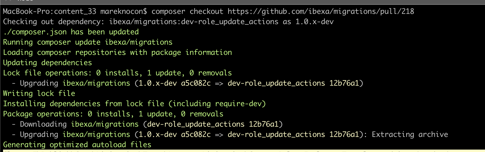

# Composer Checkout Plugin

## Description
This Composer plugin allows you to add a Pull Request from GitHub as a Composer dependency without thinking about repositories and branch aliases.
Forget about meddling with the `vendor` directory as well ;)

Simpy run `composer checkout <pullRequestUrl> [<pullRequestUrl2>...]` and the rest will be taken care of automatically.



There is also a `apply-patch` command that deals with diffs generated from Pull Requests.

## Installation

It's recommended to do the global installation:
`composer global require mnocon/composer-checkout`
which will make the new commands available in each project.

For a local install run:
`composer require mnocon/composer-checkout`

This packages requires at least PHP 7.1 and Composer 2.

## Usage

There are two new Composer commands:

### `composer checkout`

Adds a Composer dependency based on GitHub Pull Request.

Example usage:
```
composer checkout https://github.com/symfony/symfony/pull/41105
```

or interactively:
```
 composer checkout

 Please enter the number of Pull Requests [1]:
 > 1

 Link to Pull Request:
 > https://github.com/symfony/symfony/pull/41105
```

In both cases the output will be similar to this one:
```
Checking out dependency: symfony/symfony:dev-inflector-edges as 4.4.x-dev
./composer.json has been updated
Running composer update symfony/symfony
Loading composer repositories with package information
Updating dependencies
Lock file operations: 25 installs, 0 updates, 0 removals
  - Locking doctrine/annotations (1.12.1)
  - Locking doctrine/cache (1.11.0)
  - Locking doctrine/collections (1.6.7)
  - Locking doctrine/event-manager (1.1.1)
  - Locking doctrine/lexer (1.2.1)
  - Locking doctrine/persistence (2.1.0)
  - Locking friendsofphp/proxy-manager-lts (v1.0.3)
  - Locking laminas/laminas-code (4.2.1)
  - Locking laminas/laminas-eventmanager (3.3.1)
  - Locking laminas/laminas-zendframework-bridge (1.2.0)
  - Locking psr/cache (1.0.1)
  - Locking psr/container (1.1.1)
  - Locking psr/link (1.0.0)
  - Locking psr/log (1.1.4)
  - Locking symfony/contracts (v1.1.10)
  - Locking symfony/polyfill-ctype (v1.22.1)
  - Locking symfony/polyfill-intl-icu (v1.22.1)
  - Locking symfony/polyfill-intl-idn (v1.22.1)
  - Locking symfony/polyfill-intl-normalizer (v1.22.1)
  - Locking symfony/polyfill-mbstring (v1.22.1)
  - Locking symfony/polyfill-php72 (v1.22.1)
  - Locking symfony/polyfill-php73 (v1.22.1)
  - Locking symfony/polyfill-php80 (v1.22.1)
  - Locking symfony/symfony (dev-inflector-edges 8b2c097)
  - Locking twig/twig (v3.3.0)
Writing lock file
Installing dependencies from lock file (including require-dev)
Package operations: 25 installs, 0 updates, 0 removals
  - Syncing symfony/symfony (dev-inflector-edges 8b2c097) into cache
  - Installing doctrine/lexer (1.2.1): Extracting archive
  - Installing doctrine/annotations (1.12.1): Extracting archive
  - Installing doctrine/cache (1.11.0): Extracting archive
  - Installing doctrine/collections (1.6.7): Extracting archive
  - Installing laminas/laminas-zendframework-bridge (1.2.0): Extracting archive
  - Installing laminas/laminas-eventmanager (3.3.1): Extracting archive
  - Installing laminas/laminas-code (4.2.1): Extracting archive
  - Installing symfony/polyfill-intl-normalizer (v1.22.1): Extracting archive
  - Installing symfony/polyfill-mbstring (v1.22.1): Extracting archive
  - Installing symfony/polyfill-ctype (v1.22.1): Extracting archive
  - Installing twig/twig (v3.3.0): Extracting archive
  - Installing symfony/polyfill-php80 (v1.22.1): Extracting archive
  - Installing symfony/polyfill-php73 (v1.22.1): Extracting archive
  - Installing symfony/polyfill-php72 (v1.22.1): Extracting archive
  - Installing symfony/polyfill-intl-idn (v1.22.1): Extracting archive
  - Installing symfony/polyfill-intl-icu (v1.22.1): Extracting archive
  - Installing psr/container (1.1.1): Extracting archive
  - Installing psr/cache (1.0.1): Extracting archive
  - Installing symfony/contracts (v1.1.10): Extracting archive
  - Installing psr/log (1.1.4): Extracting archive
  - Installing psr/link (1.0.0): Extracting archive
  - Installing symfony/symfony (dev-inflector-edges 8b2c097): Cloning 8b2c097950 from cache
  - Installing friendsofphp/proxy-manager-lts (v1.0.3): Extracting archive
  - Installing doctrine/event-manager (1.1.1): Extracting archive
  - Installing doctrine/persistence (2.1.0): Extracting archive
5 package suggestions were added by new dependencies, use `composer suggest` to see details.
Generating autoload files
17 packages you are using are looking for funding.
Use the `composer fund` command to find out more!
```

### composer apply-patch

Applies a diff from a Pull Request using the `patch` command.

Example usage:
```
composer apply-patch https://github.com/symfony/symfony/pull/41105
```

or interactively:
```
 composer apply-patch

 Please enter the number of Pull Requests [1]:
 > 1

 Link to Pull Request:
 > https://github.com/symfony/symfony/pull/41105
```

In both cases the output will be similar to this one:
```

 [OK] Downloaded patch: patch_symfony-symfony-41105


Running command: patch -d vendor/symfony/symfony -i ../../../patch_symfony-symfony-41105 -Np1
patching file src/Symfony/Component/Inflector/Inflector.php
patching file src/Symfony/Component/Inflector/Tests/InflectorTest.php


 [OK] Applied patch!
```
